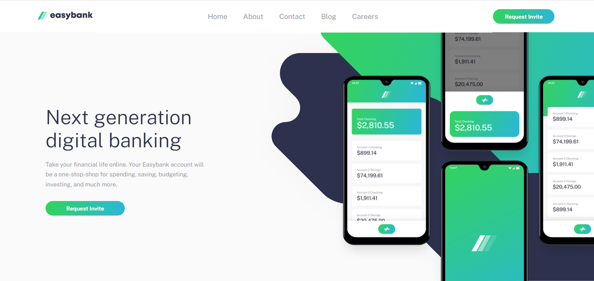

# Easybank landing page solution

This is a solution to the [Easybank landing page challenge on Frontend Mentor] 

## Table of contents

- [Overview](#overview)
  - [The challenge](#the-challenge)
  - [Screenshot](#screenshot)
  - [Links](#links)
- [My process](#my-process)
  - [Built with](#built-with)
  - [Continued development](#continued-development)

## Overview

### The challenge

Users should be able to:

- View the optimal layout for the site depending on their device's screen size
- See hover states for all interactive elements on the page

### Screenshot

### Links

- Live Site URL: [Add live site URL here]

## My process

### Built with
- Semantic HTML5 markup
- SCSS / node-sass
- vanillaJS
- Flexbox
- Mobile-first workflow

### Continued development

-Javascript Frameworks like React and Angular
-Backend Technologies such as .NET Core 
